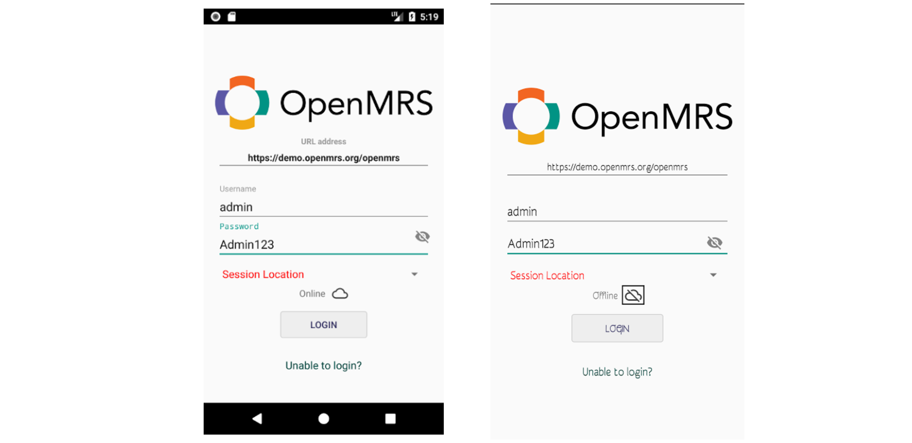
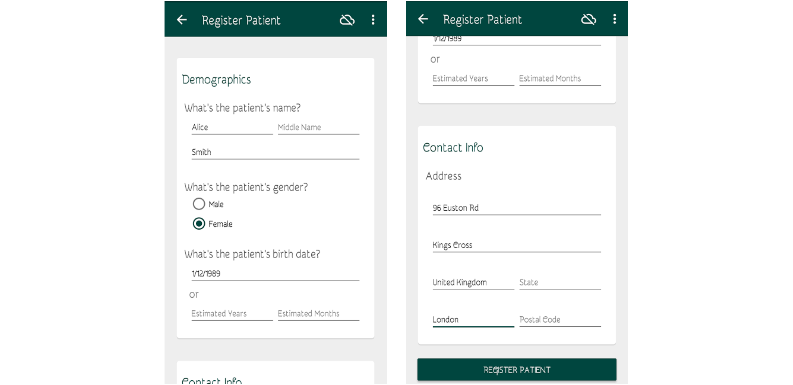
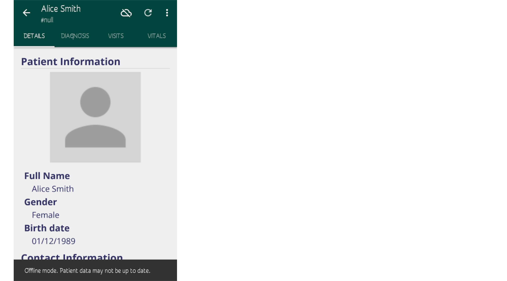
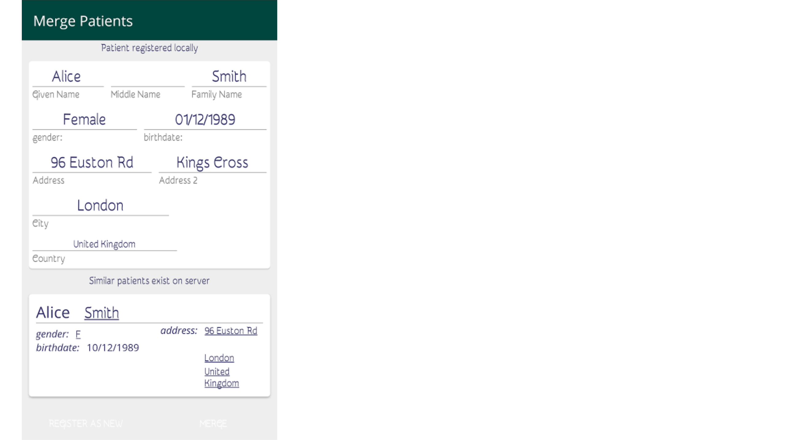
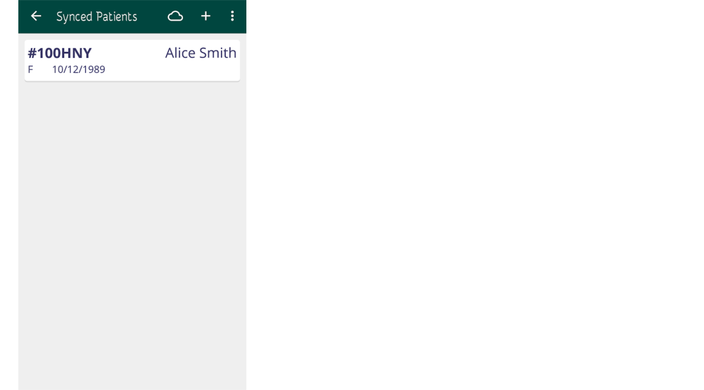
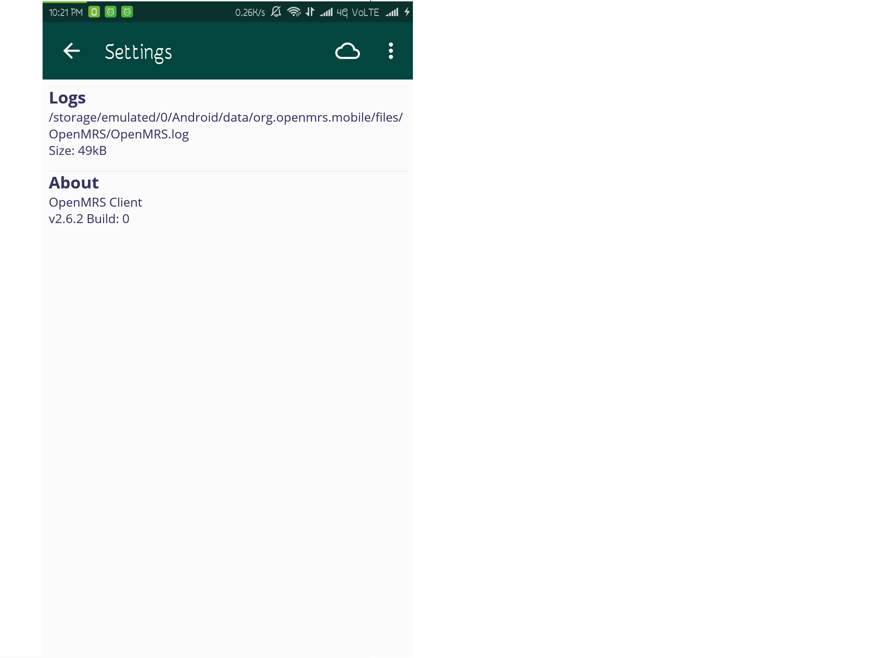

## Features
   
* ### Login
   1. Enter the server URL as  https://demo.openmrs.org/openmrs
     

   2. Now enter the username as admin and password as Admin123 .
   
   3. Select the Session location and also choose the Online/Offline option.
   
   4. Now click on Login. Now you will be redirected to the home page.

   ---

   

   Now, when heading to **Active Visits** and selecting the example patient, you will hopefully see that a *Vitals* form and a *Visit Note* form are successfully recorded during the patient's visit.

   > To learn more about the OpenMRS information model, take a look at this [guide for developers](http://guide.openmrs.org/en/Getting%20Started/openmrs-information-model.html).

* ### Entering Data

   1. Filling Up Forms

   2. Adding New Forms
       <!--Explain how to add forms on the server and basic form structure-->

   3. Form Examples
   
* ### Working Offline
    <!--Explain a bigger picture of sync on/off feature and how to switch-->
     The OpenMRS Android Client can also be sucessfully used in areas with limited connectivity. As you open the OpenMRS Android Client the login screen appears. Here you may provide your login credentials and a location (e.g. "Registration Desk")
     To use the client in the offline mode you may press the option just beside the word "online" to switch to the offline mode.
    
   

   1. Registering Patients

      <!-- Explain delayed identifier assignment and duplicate patients resolution  -->
      After successfully logging in you will be presented with a dashboard from where you can register or view patients.
      
      

      From there you can select the "Register Patient" option which will take you to a form in which you can fill the patient details.
      
      
      
      After entering all the details press the "Register Patient" button at the bottom. After successful registration of the patient you will be taken to a page which shows the summary view of the patient. While working offline the patient's ID will be `NULL`. Whenever the client will get connected to the internet it will assign an ID to the patient.
      
      

      If a similar patient is found on the server, the client will prompt you with an option to either "merge" the patients or "register as new".
      
       

   2. Synchronizing Patients

      <!-- Explain what gets synced? How often?  -->
      Whenever there is connectivity you can sync the patient data with the server. The synced patients can be seen from the "find             patients" option. The data is synced automatically whenever you're connected to the internet.
      
       
      
* ### Settings
The settings of the OpenMRS Android Client shows the path to access the log file. **A log file** records the events occurring in a software or an operating system. Logging is the process of keeping a log. All the messages are written to a single log file. Logging helps to understand what exactly a code is doing. It provides data about a code. This feature helps to fix errors and improve app operation. It helps greatly in debugging the software.

