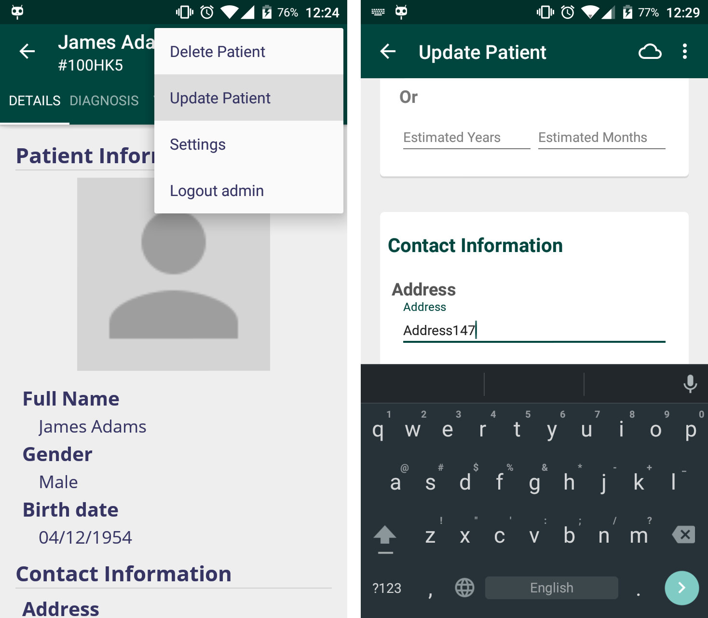
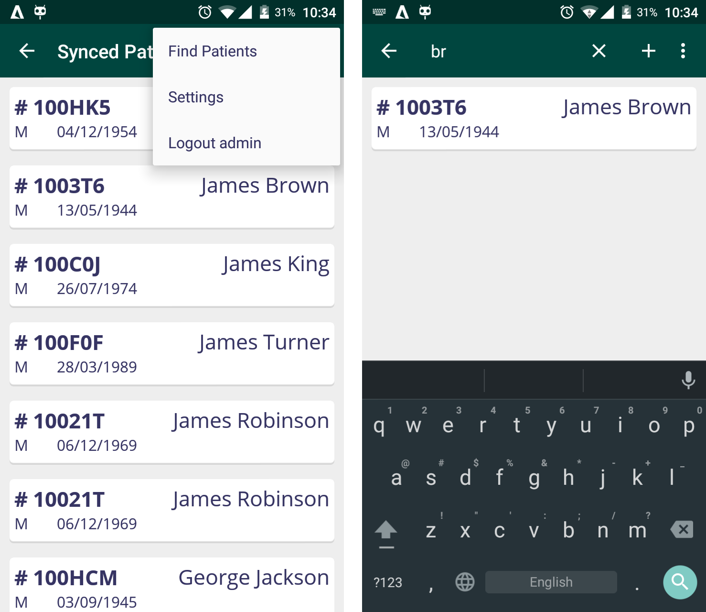
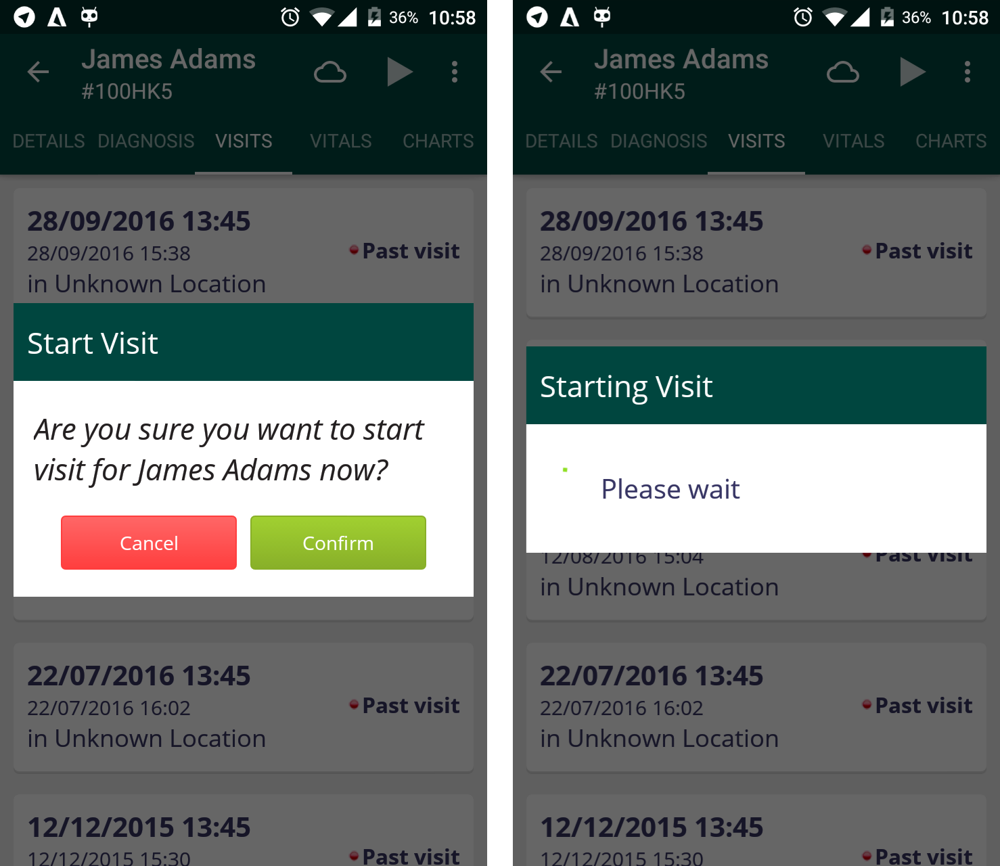
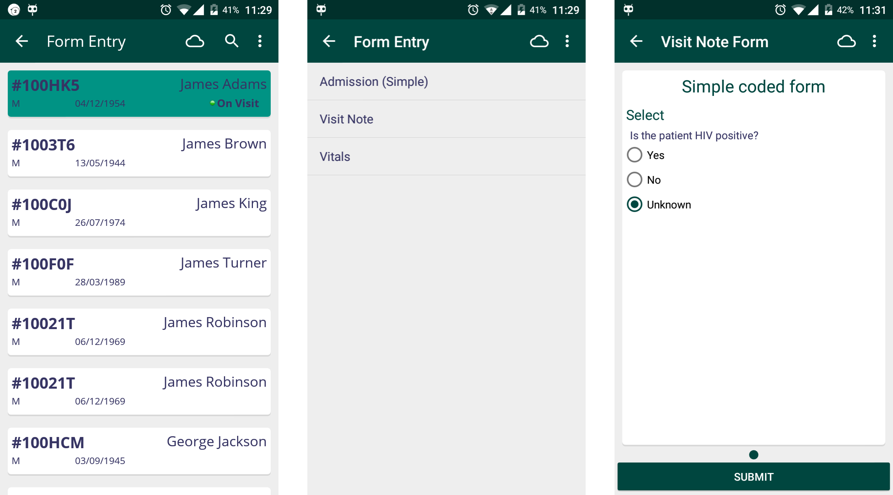
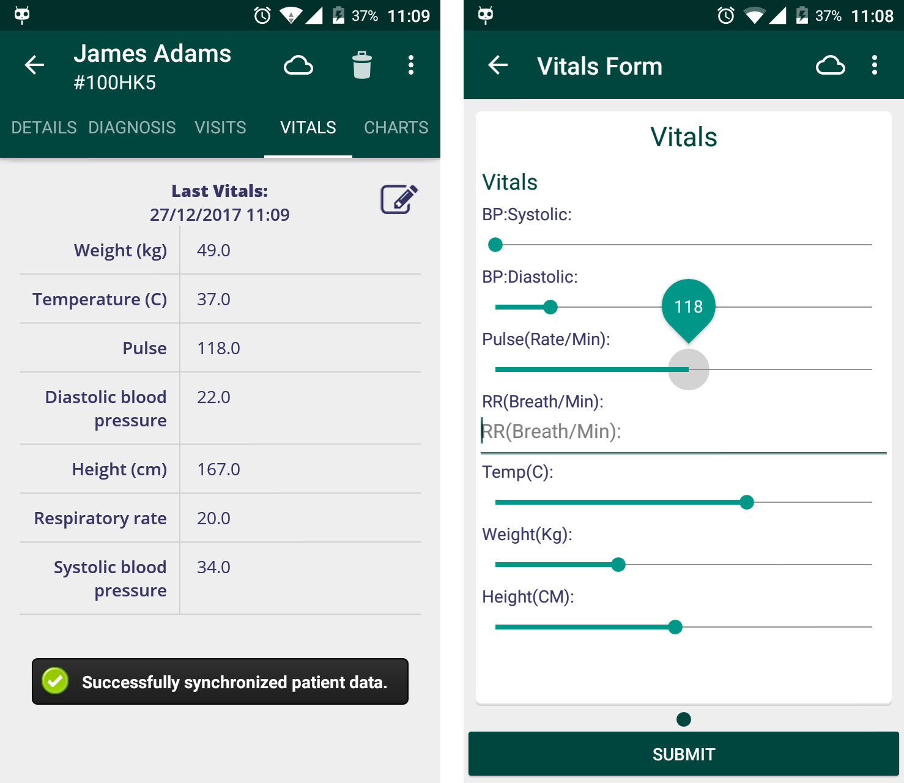

## Features

* ### Security

   <!-- Explain how data is stored and secured on the device and the SSL connection with the server -->
   
* ### Login
   1. Enter the server URL as  https://demo.openmrs.org/openmrs
     ![OpenMRS Android Client Offline login screen][login]
    
    
    [login]: assets/openmrs_android_client_offline_login.png
     
   2. Now enter the username as admin and password as Admin123 .
   
   3. Select the Session location and also choose the Online/Offline option.
   
   4. Now click on Login. Now you will be redirected to the home page.
    
    
* ### Registering Patients

   1. Entering Patient Details

   2. Adding Patient Photo

   3. Finding Similar Patients

* ### Updating Patients

  

  To update a patient's data, simply click on the patient in the **Find Patients** menu, then click the menu icon (three-dot icon) and select **Update Patient**. Now you can update any fields such as his/her name, address, phone number, etc.

  When you are done, simply press the **Submit** button at the bottom, and your patient will be updated. You can also cancel the updating process by clicking the *arrow* button in the Action bar.

* ### Viewing Patients

   Patients that you have created from the client or synced patients from the server are shown in the **Find Patients** section. From here you can select a patient to do numerous events, such as visiting the patient, capturing vitals and so forth.

   #### 1. Downloading Patients

   

   If this is your first time using the Android client, you are likely to see an empty list of patients in **Find Patients** and you'll want to download and synchronize patients from your server. To do this, click the `+` button from the action bar, then click the search button and enter a patient name. You'll be shown a list of (unsynchronized) patients matching the searched name.

   

   To download patients, simply click **Download** for patients you want to synchronize to your Android client. You can also long-press a patient to enter *Download Mode*, enabling you to download a selection of patients conveniently. Afterwards, downloaded (and synchronized) patients are seen at the *Synced Patients* screen.

   #### 2. Finding Patients

   

   To find synced patients, press on the menu icon (3-dot icon) and click **Find Patients**. Now enter a name query and it will return patients matching the inputted query.

   ---

   Now, let's click on an example (synced) patient to learn more about events relevant to a patient.

   #### Diagnosis

   When viewing a patient, you are able to see illnesses or diseases a patient suffers from. Simply head over to the **Diagnosis** tab to see the patient's list of illnesses or diseases.

   #### Visits

   A Visit is a time period when a patient is actively interacting with the healthcare system, typically at a location. In most cases with OpenMRS, this is a time when a provider is interacting actively with a patient. Visits are where *encounters* take place; which are used to record a patient's vitals, diagnose a patient and a few other things.

   

   To start a visit to a patient, simply go to the **Visits** tab and click the 'start' button in the action bar. You can see which patients are currently visited by heading to **Active Visits** from home. Now you can choose to end the visit by clicking on the visit, clicking the menu icon and clicking **End Visit**.

   #### Encounters

   Encounters usually take place during a visit, however they may also stand alone. Think of an encounter as any collection of data inputted to the EMR system. Generally speaking, every time you enter a form in OpenMRS this creates an **Encounter**.

   In the Android client, there is a collection of encounters readily made to input data to patients during their visits. This is done in the **Form Entry** section. To see the process of creating a form (an encounter) in the client, go to the **Form Entry** section from home, then select a patient (preferably a patient on a visit).

   

   Let's create a *Visit Note* form to note down experiences regarding the patient's visit. Answer the questions regarding the patient and click 'Submit' (You will see this form in the patient's visit page later on).

   #### Vitals

   

   During a visit, you are able to record a patient's vitals (commonly known as biometric data). To capture a vital, simply go to the **Vitals** tab and click on the 'note' icon. From here, you can start to input the patient's biometric data. When done, press the *Submit* button at the bottom. You can also cancel capturing a vital by using your back button or the 'up' icon in the action bar. After submitting a vital, you will see an updated patient vitals form at the vitals tab.

   #### Charts

   Finally, you may see a graph for patients, measuring height, weight and other observations corresponding to recorded patient vitals in the **Charts** tab.

   ---

   

   Now, when heading to **Active Visits** and selecting the example patient, you will hopefully see that a *Vitals* form and a *Visit Note* form are successfully recorded during the patient's visit.

   > To learn more about the OpenMRS information model, take a look at this [guide for developers](http://guide.openmrs.org/en/Getting%20Started/openmrs-information-model.html).

* ### Entering Data

   1. Filling Up Forms

   2. Adding New Forms
       <!--Explain how to add forms on the server and basic form structure-->

   3. Form Examples
   
* ### Working Offline
    <!--Explain a bigger picture of sync on/off feature and how to switch-->
     The OpenMRS Android Client can also be sucessfully used in areas with limited connectivity. As you open the OpenMRS Android Client the login screen appears. Here you may provide your login credentials and a location (e.g. "Registration Desk")
     To use the client in the offline mode you may press the option just beside the word "online" to switch to the offline mode.
    
   ![OpenMRS Android Client Offline login screen][login]
    
    
    [login]: assets/openmrs_android_client_offline_login.png

   1. Registering Patients

      <!-- Explain delayed identifier assignment and duplicate patients resolution  -->
      After successfully logging in you will be presented with a dashboard from where you can register or view patients.
      
      ![OpenMRS Android Client offline dashboard][dashboard]
      
      [dashboard]: assets/openmrs_android_client_offline_dashboard.png
      
      From there you can select the "Register Patient" option which will take you to a form in which you can fill the patient details.
      
      ![OpenMRS Android Client offline patient registration][registration]
      
      [registration]: assets/openmrs_android_client_offline_registration.png
      
      After entering all the details press the "Register Patient" button at the bottom. After successful registration of the patient you will be taken to a page which shows the summary view of the patient. While working offline the patient's ID will be `NULL`. Whenever the client will get connected to the internet it will assign an ID to the patient.
      
      ![OpenMRS Android Client patient summary][summary]
    
      [summary]: assets/openmrs_android_client_offline_patient_details.png
      
      If a similar patient is found on the server, the client will prompt you with an option to either "merge" the patients or "register as new".
      
       ![OpenMRS Android Client merge patients][merge]
       
       [merge]: assets/openmrs_android_client_offline_merge_patients.png

   2. Synchronizing Patients

      <!-- Explain what gets synced? How often?  -->
      Whenever there is connectivity you can sync the patient data with the server. The synced patients can be seen from the "find             patients" option. The data is synced automatically whenever you're connected to the internet.
      
      ![OpenMRS Android Client synced patients][synced_patients]
      
      [synced_patients]: assets/openmrs_android_client_offline_synced_patients.png
      
* ### Settings
The settings of the OpenMRS Android Client shows the path to access the log file. **A log file** records the events occurring in a software or an operating system. Logging is the process of keeping a log. All the messages are written to a single log file. Logging helps to understand what exactly a code is doing. It provides data about a code. This feature helps to fix errors and improve app operation. It helps greatly in debugging the software.

