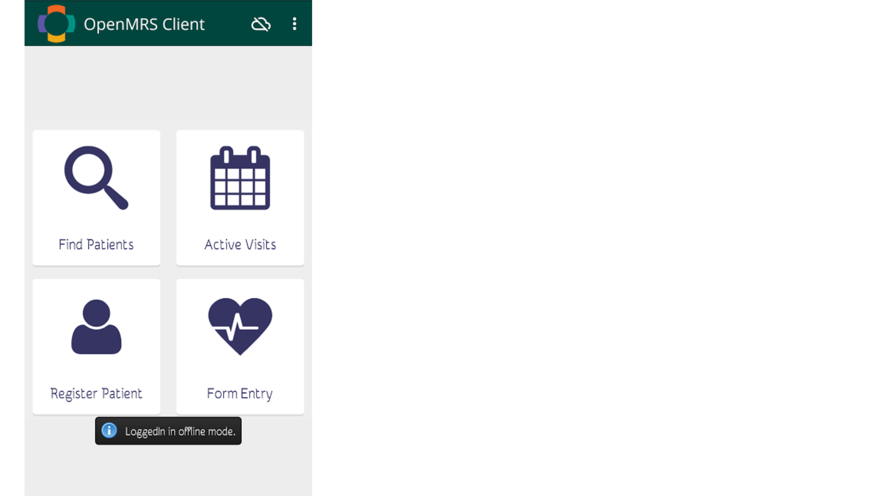

## Features
   
* ### Login
   1. Enter the server URL as  https://demo.openmrs.org/openmrs
     

   2. Now enter the username as admin and password as Admin123 .
   
   3. Select the Session location and also choose the Online/Offline option.
   
   4. Now click on Login. Now you will be redirected to the home page.
    
    
* ### Registering Patients

  You can register new patients by clicking on the **Register Patient** button in the home menu. When online, created patients are automatically synchronized to the server wih a unique patient ID. When offline, created patients are saved in the user's local database and are synced when the user is connected to the internet. See [Working Offline](#working-offline) for more details.

   #### 1. Entering Patient Details

   <!-- -->

   

   After clicking **Register Patient**, you will be presented with a form to fill out the patient's basic information. You should input the patient's name, gender and birth date. You'll also need to fill at least one field of the patient's contact information. When done, press "Register Patient" button at the bottom.

   If you did not enter the required details, you will be shown a message showing which fields are needed to be filled in order to complete registration.

   

   After successfully adding a new patient, a summary regarding patient's data along with the patient photo is shown. From here you can start to interact with the patient, such as visiting the patient and entering biometrics data in the patient's vitals. These events are easily accessed by either swiping right/left or clicking on the event's tab. Take a look at [Viewing Patients](#viewing-patients) for more things to do with a patient.

   You can also update or delete the patient by heading to the menu and clicking **Update Patient** or **Delete Patient**.

   #### 2. Adding Patient Photo

   

   A cool feature in the Android client during registration is the ability to upload a photo related to the patient. To do this, click on the camera icon. You can either take a photo now or choose an existing photo in your phone/tablet. The photo will then be cropped to match the requried dimensions.

   #### 3. Finding Similar Patients

   

   When [registering a new patient offline](#working-offline), similar existing patients will be shown to help you merge the patients. Similar patients are defined by patients having the same **names**, **gender**, **address** and **date of birth**. You can choose either to merge to an existing patient, or register the patient as new. Either way, the patient data will be synced when connected to the internet.

* ### Updating Patients

  

  To update a patient's data, simply click on the patient in the **Find Patients** menu, then click the menu icon (three-dot icon) and select **Update Patient**. Now you can update any fields such as his/her name, address, phone number, etc.

  When you are done, simply press the **Submit** button at the bottom, and your patient will be updated. You can also cancel the updating process by clicking the *arrow* button in the Action bar.

* ### Viewing Patients

   Patients that you have created from the client or synced patients from the server are shown in the **Find Patients** section. From here you can select a patient to do numerous events, such as visiting the patient, capturing vitals and so forth.

   #### 1. Downloading Patients

   

   If this is your first time using the Android client, you are likely to see an empty list of patients in **Find Patients** and you'll want to download and synchronize patients from your server. To do this, click the `+` button from the action bar, then click the search button and enter a patient name. You'll be shown a list of (unsynchronized) patients matching the searched name.

   

   To download patients, simply click **Download** for patients you want to synchronize to your Android client. You can also long-press a patient to enter *Download Mode*, enabling you to download a selection of patients conveniently. Afterwards, downloaded (and synchronized) patients are seen at the *Synced Patients* screen.

   #### 2. Finding Patients

   

   To find synced patients, press on the menu icon (3-dot icon) and click **Find Patients**. Now enter a name query and it will return patients matching the inputted query.

   ---

   

   Now, when heading to **Active Visits** and selecting the example patient, you will hopefully see that a *Vitals* form and a *Visit Note* form are successfully recorded during the patient's visit.

   > To learn more about the OpenMRS information model, take a look at this [guide for developers](http://guide.openmrs.org/en/Getting%20Started/openmrs-information-model.html).

* ### Entering Data

   1. Filling Up Forms

   2. Adding New Forms
       <!--Explain how to add forms on the server and basic form structure-->

   3. Form Examples
   
* ### Working Offline
    <!--Explain a bigger picture of sync on/off feature and how to switch-->
     The OpenMRS Android Client can also be sucessfully used in areas with limited connectivity. As you open the OpenMRS Android Client the login screen appears. Here you may provide your login credentials and a location (e.g. "Registration Desk")
     To use the client in the offline mode you may press the option just beside the word "online" to switch to the offline mode.
    
   

   1. Registering Patients

      <!-- Explain delayed identifier assignment and duplicate patients resolution  -->
      After successfully logging in you will be presented with a dashboard from where you can register or view patients.
      
      

      From there you can select the "Register Patient" option which will take you to a form in which you can fill the patient details.
      
      
      
      After entering all the details press the "Register Patient" button at the bottom. After successful registration of the patient you will be taken to a page which shows the summary view of the patient. While working offline the patient's ID will be `NULL`. Whenever the client will get connected to the internet it will assign an ID to the patient.
      
      

      If a similar patient is found on the server, the client will prompt you with an option to either "merge" the patients or "register as new".
      
       

   2. Synchronizing Patients

      <!-- Explain what gets synced? How often?  -->
      Whenever there is connectivity you can sync the patient data with the server. The synced patients can be seen from the "find             patients" option. The data is synced automatically whenever you're connected to the internet.
      
       
      
* ### Settings
The settings of the OpenMRS Android Client shows the path to access the log file. **A log file** records the events occurring in a software or an operating system. Logging is the process of keeping a log. All the messages are written to a single log file. Logging helps to understand what exactly a code is doing. It provides data about a code. This feature helps to fix errors and improve app operation. It helps greatly in debugging the software.

