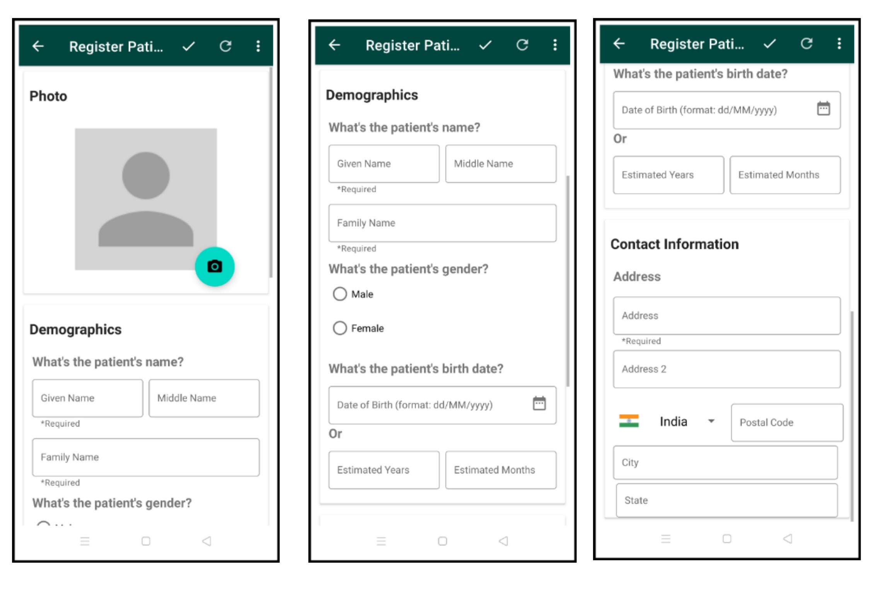
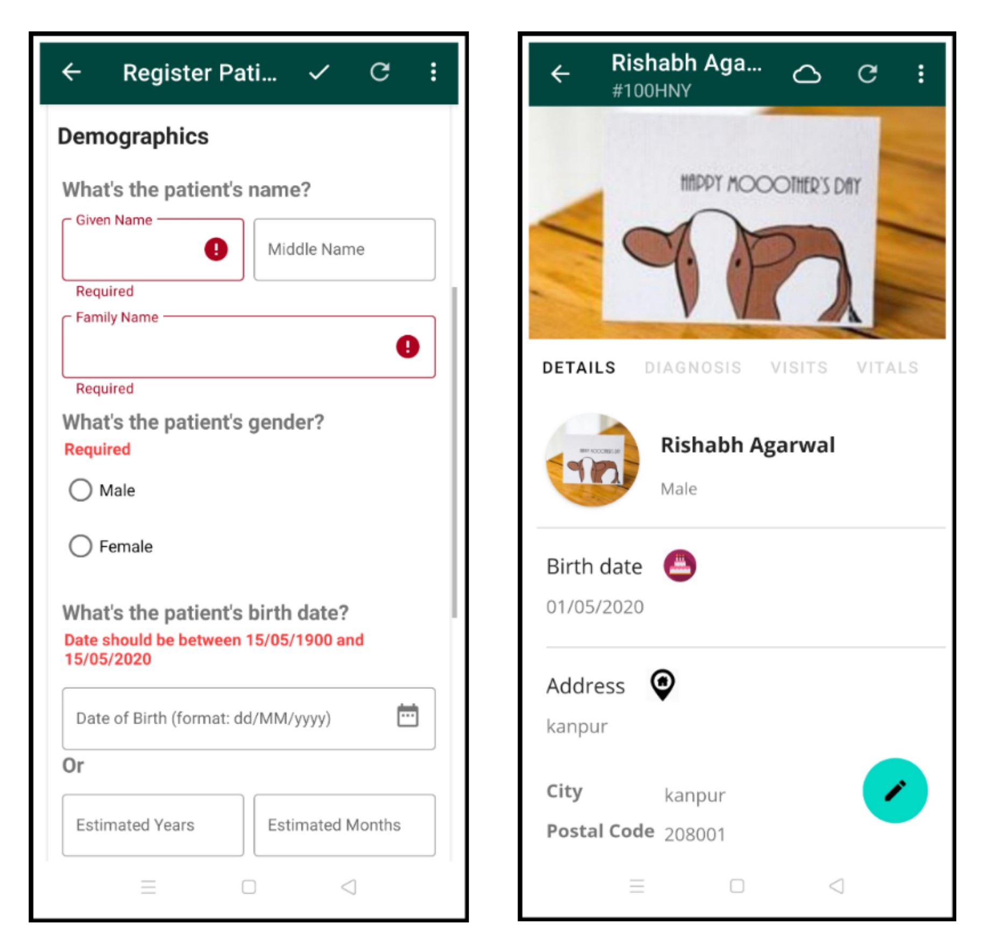
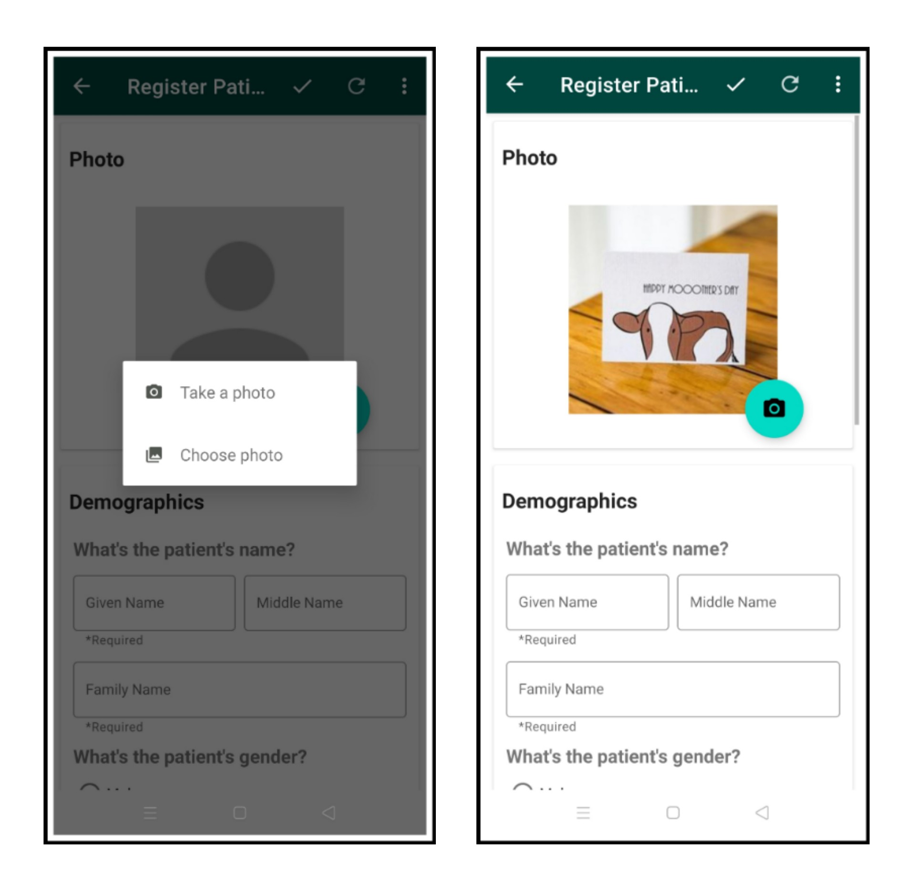
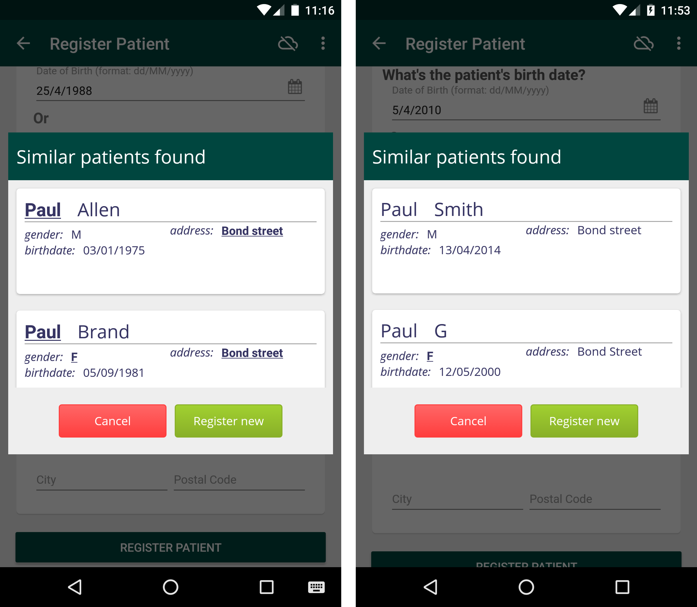
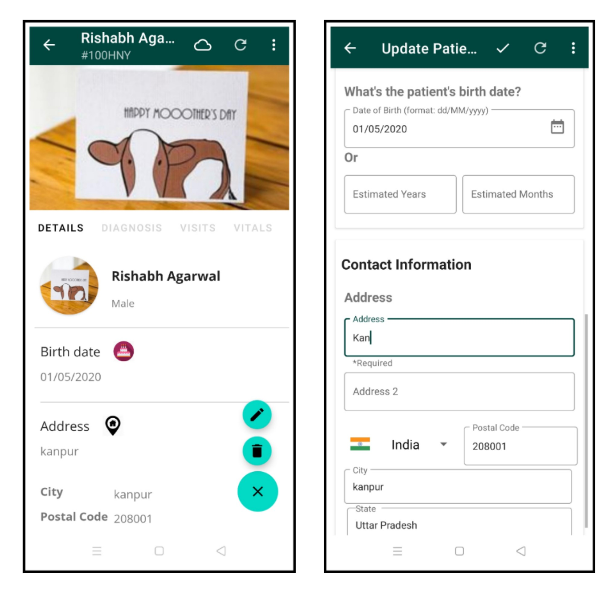
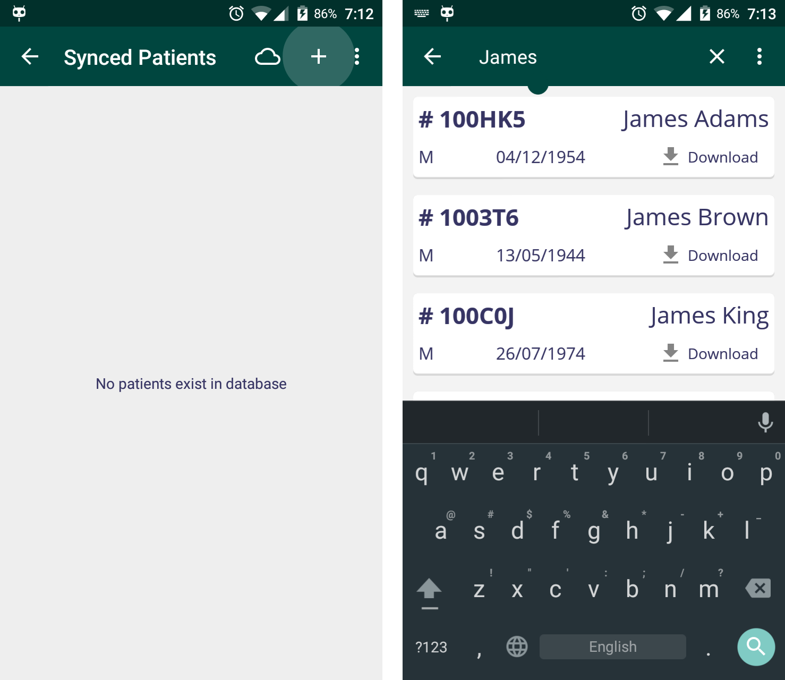
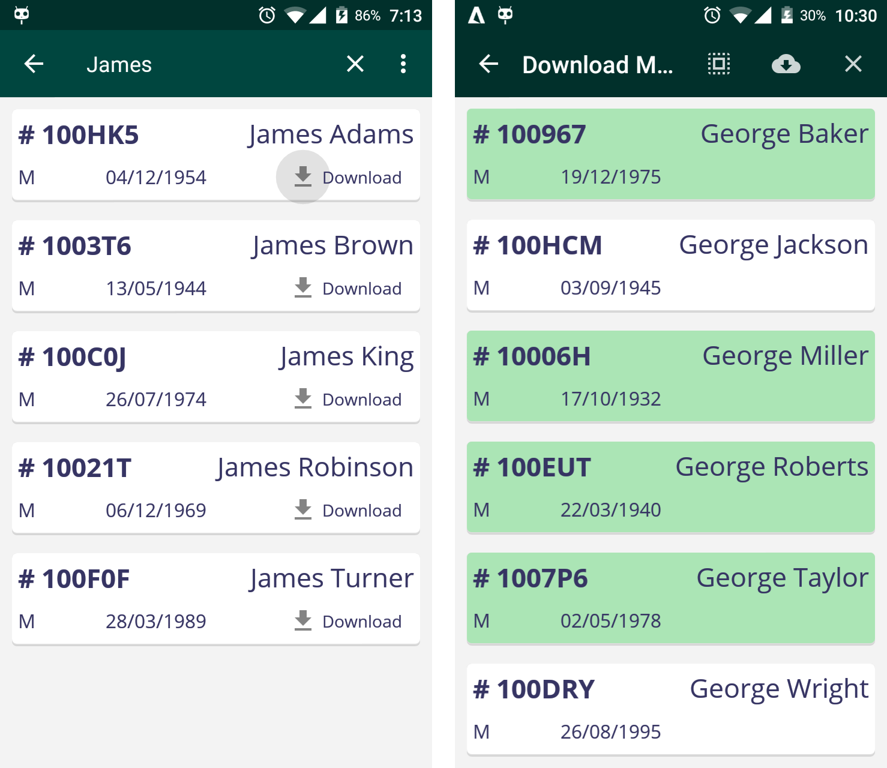
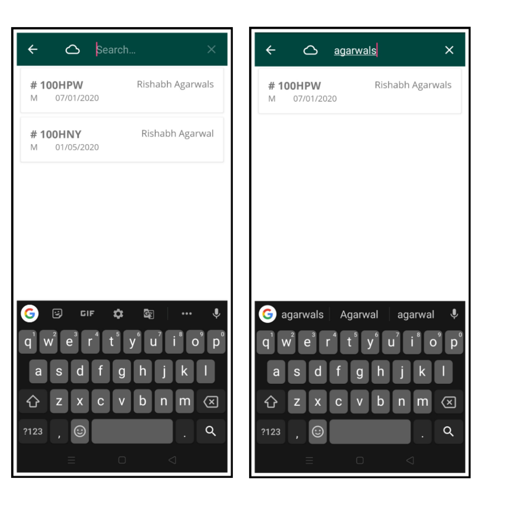

## Registering a New Patient

You can register new patients by clicking on the **Register Patient** button in the home menu. When online, created patients are automatically synchronized to the server wih a unique patient ID. When offline, created patients are saved in the user's local database and are synced when the user is connected to the internet. See [Working Offline](#working-offline) for more details.

#### 1. Entering Patient Details

After clicking **Register Patient**, you will be presented with a form to fill out the patient's basic information. You should input the patient's name, gender and birth date. You'll also need to fill at least one field of the patient's contact information. When done, press "Register Patient" button at the bottom.

If you did not enter the required details, you will be shown a message showing which fields are needed to be filled in order to complete registration.

After successfully adding a new patient, a summary regarding patient's data along with the patient photo is shown. From here you can start to interact with the patient, such as visiting the patient and entering biometrics data in the patient's vitals. These events are easily accessed by either swiping right/left or clicking on the event's tab. Take a look at [Viewing Patients](#viewing-patients) for more things to do with a patient.

You can also update or delete the patient by heading to the menu and clicking **Update Patient** or **Delete Patient**.

#### 2. Adding Patient Photo

A cool feature in the Android client during registration is the ability to upload a photo related to the patient. To do this, click on the camera icon. You can either take a photo now or choose an existing photo in your phone/tablet. The photo will then be cropped to match the requried dimensions.

#### 3. Finding Similar Patients

When [registering a new patient offline](#working-offline), similar existing patients will be shown to help you merge the patients. Similar patients are defined by patients having the same **names**, **gender**, **address** and **date of birth**. You can choose either to merge to an existing patient, or register the patient as new. Either way, the patient data will be synced when connected to the internet.

## Updating a Patient

To update a patient's data, simply click on the patient in the **Find Patients** menu, then click the menu icon (three-dot icon) and select **Update Patient**. Now you can update any fields such as his/her name, address, phone number, etc.

When you are done, simply press the **Submit** button at the bottom, and your patient will be updated. You can also cancel the updating process by clicking the _arrow_ button in the Action bar.

## Viewing Patients

Patients that you have created from the client or synced patients from the server are shown in the **Find Patients** section. From here you can select a patient to do numerous events, such as visiting the patient, capturing vitals and so forth. See the [patient activity page](patient-activity.md) for more details.

## Downloading Patients

If this is your first time using the Android client, you are likely to see an empty list of patients in **Find Patients** and you'll want to download and synchronize patients from your server. To do this, click the `+` button from the action bar, then click the search button and enter a patient name. You'll be shown a list of (unsynchronized) patients matching the searched name.

To download patients, simply click **Download** for patients you want to synchronize to your Android client. You can also long-press a patient to enter _Download Mode_, enabling you to download a selection of patients conveniently. Afterwards, downloaded (and synchronized) patients are seen at the _Synced Patients_ screen.

## Finding Existing Patients

To find locally synchronized patients, press on the menu icon (3-dot icon) and click **Find Patients**. Now enter a name query and it will return patients matching the inputted query.
