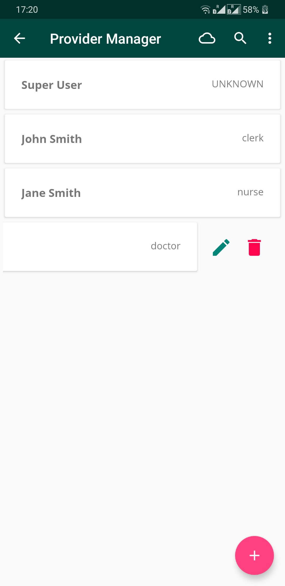
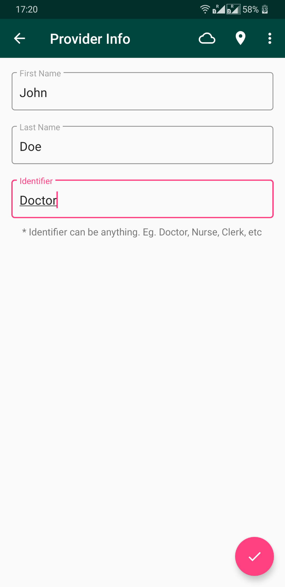
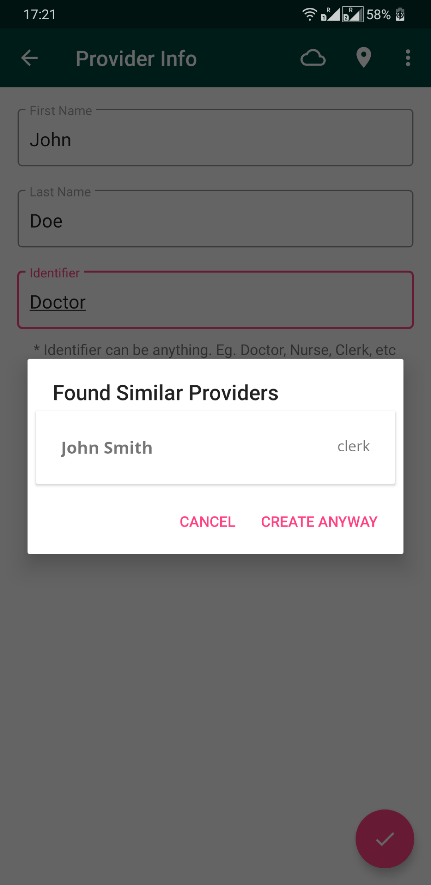
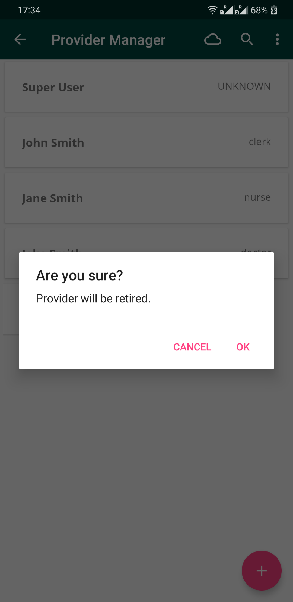
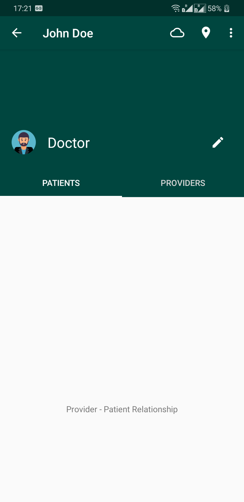

# Provider Management

This module lets you manage Providers by providing actions such as **Creating, Deleting or Editing** Providers with offline support for these operations. You can also see all the other Providers, their roles and their relationships with other Providers or Patients.

#### Create Provider

On opening the Provider Management, you are greeted with a screen with active providers and a **Floating Action Button**. **Click** on the **Floating Action Button** and it will take you to new screen asking for Provider details. 

The details are then matched with other existing Providers and a dialog box is shown for confirmation. If the device is online, the provider is synced to the server, otherwise the created provider is saved offline and will be synced when your device is back online.

#### Update Providers

To update a Provider, **swipe left** on the Provider to reveal additional actions (Update and Delete). **Click** on the **edit** button. It will take you to a screen where the details can be edited. If the device is online the provider gets synced to the servers otherwise your edited provider gets saved offline and gets synced later.

#### Delete Providers

To delete a Provider, **swipe left** on the Provider to reveal additional actions(*Update and Delete*). Click on the **delete** button and a confirmation to delete the Provider will be shown.If the device is online the provider gets deleted from the servers as well otherwise it gets deleted from the app and then from the servers later

#### Provider Relationship Dashboard

**Click** on a particular Provider, to go to a new screen with the Provider's details. It has 2 tabs - Provider-Patient relationships and Provider-Provider relationships. Currently these screens are empty. 

Provider Relationship will be added to this screen in the future.

> To learn more about the OpenMRS information model, take a look at this [guide for developers](http://guide.openmrs.org/en/Getting%20Started/openmrs-information-model.html).
