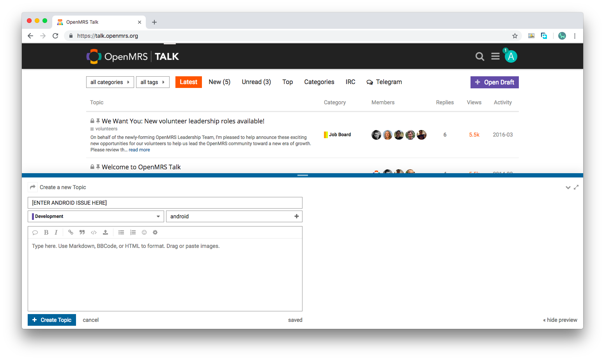

# Troubleshooting Android Client

#### Can't Login?

There are a few things you would need to first take note in logging in. Make sure that you enter a valid server for the URL address. Moreover, the username and password does not correspond to your OpenMRS ID. Follow the information on the link [here](https://openmrs.github.io/openmrs-android-client-user-guide/introduction.html) to log into the test server. 

#### Have Another Issue?

This guide covers the basic development setup and things to take note off while using the android client. Make sure the guide first. The guide walks through the basics of entering patient details, uploading patient photos, etc, which you could check out [here](https://openmrs.github.io/openmrs-android-client-user-guide/features.html).

However, if there are other issues you come across, you could take the following steps.

#### 1. Visit OpenMRS Talk 

You could check out current issues by searching "android client" as seen in the picture below. 

If not, you could file an issue as seen below. 

#### 2. File in JIRA 

As an OpenMRS developer, you could opt to file an issue in the JIRA as seen below. If you are new to the OpenMRS environment, you would need to go to helpdesk and ask for JIRA access first.

