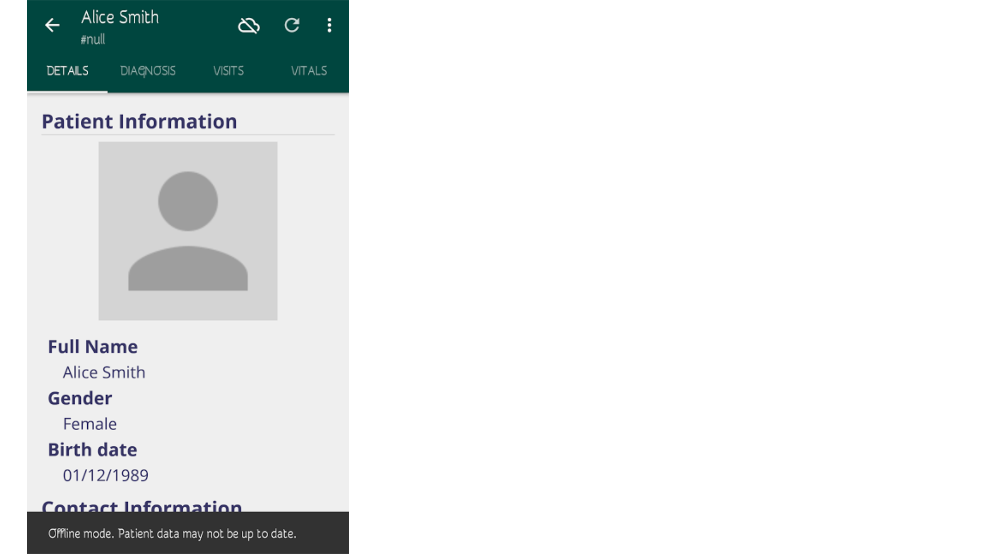

# Working Offline
<!--Explain a bigger picture of sync on/off feature and how to switch-->
The OpenMRS Android Client can also be successfully used in areas with limited connectivity. As you open the OpenMRS Android Client the login screen appears. Here you may provide your login credentials and a location (e.g. "Registration Desk")
To use the client in the offline mode you may press the option just beside the word "online" to switch to the offline mode. 

*Using Offline Mode requires a previous sign-in with the credentials provided, and thus is disabled on initial login attempts*
    

#### Registering Patients

   <!-- Explain delayed identifier assignment and duplicate patients resolution  -->
   After successfully logging in you will be presented with a dashboard from where you can register or view patients.
      
   

   From there you can select the **Register Patient** option which will take you to a form in which you can fill the patient details.
      
   
      
   After entering all the details press the "Register Patient" button at the bottom. After successful registration of the patient you will be taken to a page which shows the summary view of the patient. While working offline the patient's ID will be `NULL`. Whenever the client will get connected to the internet it will assign an ID to the patient.
      
   

   If a similar patient is found on the server, the client will prompt you with an option to either "merge" the patients or "register as new".
      
   

#### Synchronizing Patients

   <!-- Explain what gets synced? How often?  -->
   Whenever there is connectivity you can sync the patient data with the server. The synced patients can be seen from the **Find Patients** section. The data is synced automatically whenever you're connected to the internet.
      
    

Currently, patient activity under offline mode is limited to [inputting encounters](patient-activity.md#encounters).
